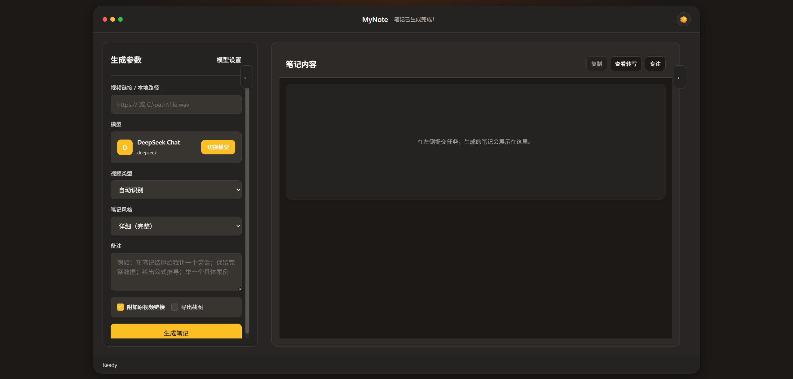
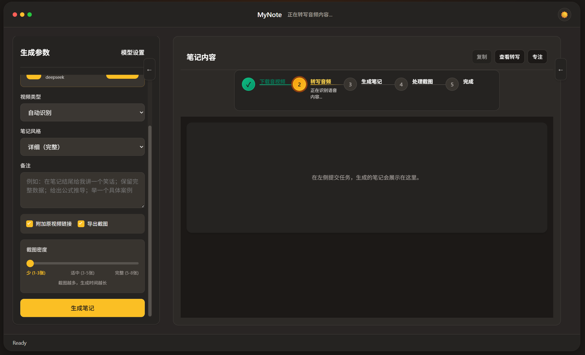
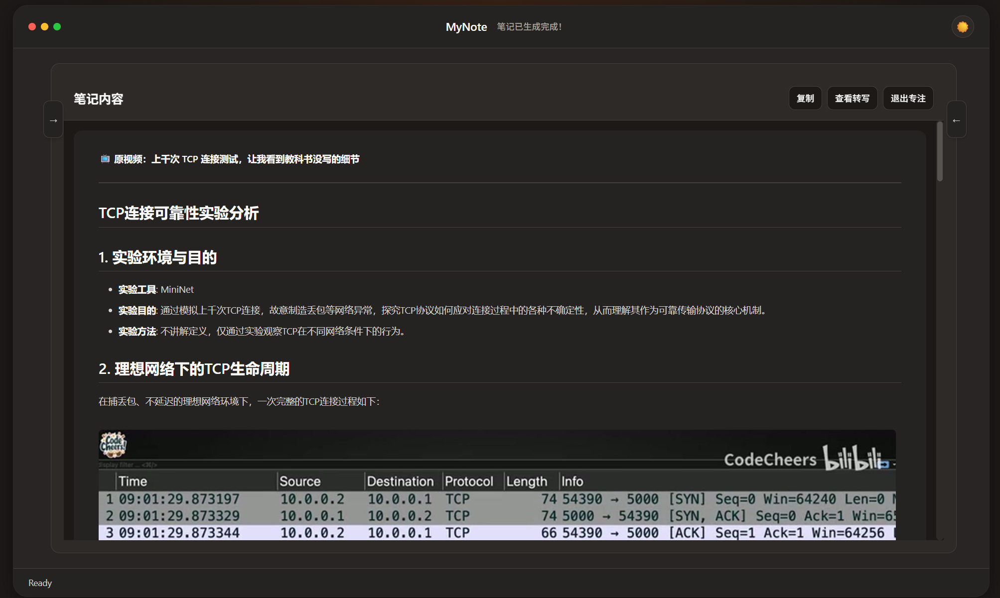
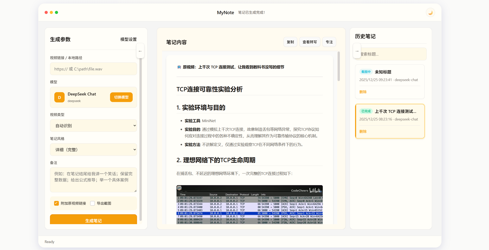
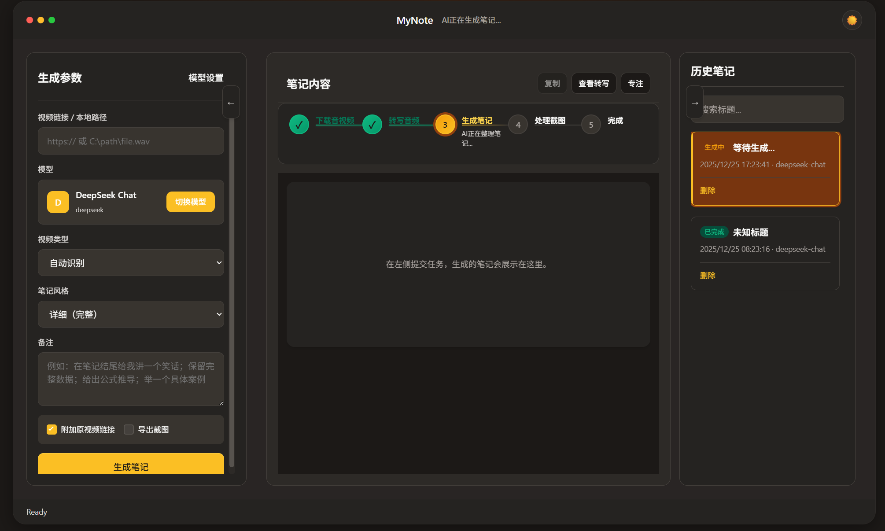
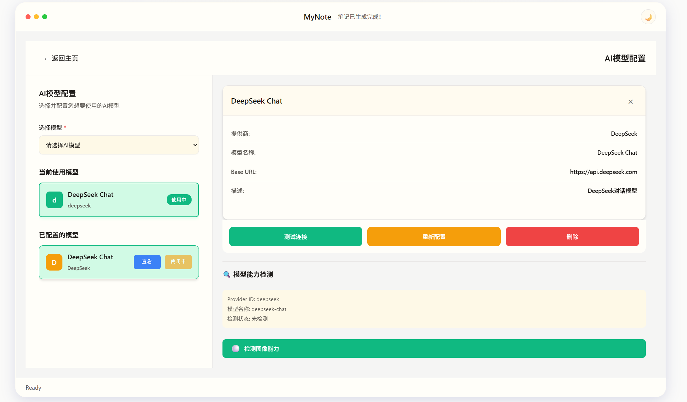

<p align="center">
  
</p>

<h1 align="center">MyNote v2.0.0</h1>

<p align="center">
  <em>AI 智能视频笔记生成工具 - 让 AI 为你的视频做笔记</em>
</p>

<p align="center">
  
  
  
  
</p>

## 项目简介

MyNote 是一个创新的 AI 视频笔记助手，通过智能分析视频内容，自动提取关键帧并生成结构化的 Markdown 笔记。

## 核心亮点

### 亮点一：智能关键帧选择系统

**无需大模型浏览全视频**，先提取关键时间点，再对每点的5帧候选图像使用多模态AI或OCR策略智能选择最佳截图，兼容所有模型能力。

### 亮点二：动态并发优化系统

**根据机器配置自动调整线程数**，通过三级并发架构实现性能最大化，处理速度提升6-12倍。

## 功能特性展示

### 核心功能

- **多平台视频支持**: Bilibili、YouTube、本地视频文件
- **智能关键帧提取**: AI 识别重要时间点，无需浏览全视频
- **双策略截图选择**: 多模态AI + OCR降级，兼容所有模型
- **智能音频转写**: Fast-Whisper 本地转写，支持 CUDA 加速
- **AI 内容总结**: 支持 OpenAI 兼容的大模型
- **结构化笔记**: 自动生成 Markdown 格式，支持数学公式渲染
- **实时进度**: SSE 服务器推送，实时反馈任务状态
- **任务历史**: 本地数据库存储，随时查看历史记录

### 高级特性

- **多种笔记风格**: 精简/详细/教学/小红书
- **视频类型识别**: 自动识别或手动选择（技术/对话/科普/测评）
- **截图密度调节**: 三档可调（低/中/高），满足不同需求
- **原视频跳转**: 可选附加原视频链接，一键跳转
- **自定义备注**: 支持添加额外指令
- **多模型支持**: GPT、千问、DeepSeek 等，动态能力检测
- **亮暗模式**: 自动跟随系统或手动切换

### 截图预览

1. **主页界面**

   

   视频链接输入、参数配置面板

2. **任务进行中**

   

   实时进度反馈和状态提示

3. **笔记预览**

   

   生成的 Markdown 笔记和截图展示

4. **亮色模式**

   

   亮色主题界面

5. **暗色模式**

   

   暗色主题界面

6. **模型设置**

   

   模型配置界面

## 安装与启动

### 环境要求

#### 1. Python 3.9+

**下载地址**: https://www.python.org/downloads/

**安装步骤**:
1. 下载 Python 3.9 或更高版本安装包
2. 安装时勾选 "Add Python to PATH"
3. 验证安装：打开命令行输入 `python --version`

**推荐版本**: Python 3.10 或 3.11

#### 2. FFmpeg（必须）

**下载地址**: https://www.gyan.dev/ffmpeg/builds/

**安装步骤**:
1. 下载 "ffmpeg-release-essentials.zip" (Windows)
2. 解压到 `C:\ffmpeg`
3. 添加到系统 PATH：
   - 右键 "此电脑" → 属性 → 高级系统设置
   - 环境变量 → 系统变量 → Path → 新建
   - 添加 `C:\ffmpeg\bin`
4. 验证安装：重新打开命令行输入 `ffmpeg -version`

#### 3. Node.js（用于前端）

**下载地址**: https://nodejs.org/

**安装步骤**:
1. 下载 LTS 版本安装包
2. 运行安装程序（默认配置即可）
3. 验证安装：命令行输入 `node --version` 和 `npm --version`

### 启动方式

#### 方式一：一键启动（推荐）

适用于环境已配置完成的情况

双击运行 `window.bat`，脚本会自动：

1. **环境检测**
   - 检测 Python 版本（要求 3.9+）
   - 检测 Node.js 和 npm
   - 检测 ffmpeg 安装

2. **依赖安装**
   - 自动安装后端 Python 依赖
   - 检测前端依赖，如需要会提示安装

3. **服务启动**
   - 启动后端服务（端口 8000）
   - 启动前端服务（端口 5173）
   - 自动打开浏览器

#### 方式二：手动安装启动

适用于首次使用或需要自定义配置的用户

**1. 克隆仓库**
```bash
git clone https://github.com/yourusername/MyNote.git
cd MyNote
```

**2. 安装后端依赖**
```bash
cd newbackend

# 创建虚拟环境（推荐）
python -m venv venv

# 激活虚拟环境
# Windows:
venv\Scripts\activate
# Linux/Mac:
source venv/bin/activate

# 安装依赖
pip install -r requirements.txt
```

**3. 安装前端依赖**
```bash
cd ../1211front

# 安装依赖（推荐使用 pnpm，也可用 npm）
pnpm install
# 或
npm install
```

**4. 验证环境**
```bash
# 验证 Python 依赖
python -c "import fastapi; import faster_whisper; import openai; import easyocr"

# 验证 ffmpeg
ffmpeg -version

# 验证 Node.js
node --version
npm --version
```

**5. 启动服务**

启动后端：
```bash
cd newbackend
python start_server.py
```

后端将运行在 `http://localhost:8000`
API 文档: `http://localhost:8000/docs`

启动前端（新开命令行窗口）：
```bash
cd 1211front
pnpm dev
# 或
npm run dev
```

前端将运行在 `http://localhost:5173`

## 技术架构

### 后端技术栈

- **框架**: FastAPI 0.115 + SQLAlchemy 2.0
- **异步**: asyncio + BackgroundTasks
- **AI 集成**: OpenAI 兼容 API（多模态）
- **OCR**: EasyOCR + 多线程并行
- **音频转写**: Faster-Whisper（支持 CUDA）
- **数据库**: SQLite + DAO 模式（短连接）
- **视频下载**: yt-dlp
- **性能优化**: psutil（系统资源监控）

### 前端技术栈

- **框架**: Vue 3.5 + TypeScript 5.9
- **状态管理**: Pinia 3.0
- **路由**: Vue Router 4.6
- **构建工具**: Vite 7.2
- **UI 特性**: Composition API、亮暗模式、SSE 实时通信
- **Markdown 渲染**: markdown-it + katex（数学公式）

### 核心架构流程

```
用户提交视频URL
    ↓
视频下载 (yt-dlp)
    ↓
音频转写 (Whisper) → 转录文本
    ↓
AI分析关键点 → 提取10-15个重要时间点
    ↓
并发生成候选截图 (每个点5帧)
    ↓
模型能力检测 (问答方式)
    ↓
    ├─ 支持图像 → 多模态AI分析5张图 → 选择最佳1张
    └─ 不支持 → EasyOCR并行识别5张 → 评分算法选最佳
    ↓
生成结构化笔记 (Markdown)
    ↓
返回结果 + 实时进度推送
```

### 性能指标

- **处理速度**: 提升 6-12 倍（三级并发架构）
- **API 调用**: 减少 80%（5次→1次）
- **并发能力**: 从 5-6 提升到 20-30 个任务
- **代码行数**: 减少 30%（架构优化）
- **截图质量**: 真正的视觉内容分析，不再随机选择

## 核心创新详解

### 7.1 智能关键帧选择系统

#### 传统方案的问题

- 需要让大模型"观看"整个视频 → 成本高、速度慢
- 基于文件名随机选择截图 → 无法分析图像内容
- 只支持单一模式 → 无法适应不同模型能力

#### MyNote 的创新方案

**第一步：提取关键时间点**

```
视频转写 → AI分析重要性 → 识别关键知识点时间点
(例如：3:24, 7:15, 12:40... 共10-15个点)
```

**第二步：生成候选截图**

```
每个关键点前后截取5帧
(例如：7:13, 7:14, 7:15, 7:16, 7:17)
```

**第三步：智能选择最佳截图**

**策略A: 多模态AI（推荐）**

```python
# Base64编码5张候选图像
images_base64 = [encode_image(img) for img in candidates]

# 单次API调用，AI同时分析5张图
response = ai_client.chat.completions.create(
    model=model_name,
    messages=[{
        "role": "user",
        "content": [
            {"type": "image_url", "image_url": {"url": img64}}
            for img64 in images_base64
        ] + [
            {"type": "text", "text": "选择最清晰、内容最完整的一张"}
        ]
    }]
)
```

**优势**: 真正理解图像内容（清晰度、完整性、代表性）

**策略B: OCR降级（兼容非视觉模型）**

```python
# 4线程并行OCR识别
with ThreadPoolExecutor(max_workers=4) as executor:
    results = executor.map(ocr_read, candidates)

# 信息评分算法
for text, confidence in results:
    score = (
        min(len(text)/100, 1.0) * 0.4 +           # 文本密度
        (len(set(text.split()))/len(text.split())) * 0.3 +  # 词汇多样性
        (count_numbers(text)+count_special(text))/len(text) * 0.2 +  # 复杂度
        confidence * 0.1                           # 置信度
    )
```

**OCR评分公式**:

```
Score = 文本密度×40% + 词汇多样性×30% + 复杂度×20% + 置信度×10%
```

其中：
- 文本密度 = min(字符数/100, 1.0)  # 文字越丰富越好
- 词汇多样性 = 唯一词数/总词数      # 词汇越多样越好
- 复杂度 = (数字+特殊字符)/字符数   # 技术内容越多越好
- 置信度 = OCR识别置信度            # 越准确越好

#### 模型能力自动检测

- 请求开始时，通过简单问答检测模型是否支持图像
- 检测结果缓存24小时，避免重复调用
- 根据能力自动选择AI或OCR策略

```
"你有图像理解能力吗？有返回1，没有返回2"
```

### 7.2 动态并发优化系统

#### 问题：固定并发数无法适应不同机器配置

#### 动态线程数计算

```python
def calculate_optimal_workers():
    physical_cores = psutil.cpu_count(logical=False)  # 物理核心

    if physical_cores <= 4:
        return 4  # 低配置：4线程
    elif physical_cores <= 8:
        return max(6, physical_cores // 2)  # 中配置：核心/2
    else:
        return max(8, physical_cores // 2)  # 高配置：核心/2，最多10线程
```

**线程选择对照表**:

```
CPU物理核心数    OCR线程数    时间点并发数    图像并发数
    ≤4           4线程         3个            2张
    4-8          6线程         3个            2张
    8-16         8线程         4个            3张
    >16          10线程        4个            3张
```

**设计原则**:
- OCR线程数 = min(物理核心/2, 10)，保留50%资源给其他进程
- 时间点并发 = 3-4个，避免内存占用过高
- 图像并发 = 2-3张，平衡速度和API限制

#### 三级并发架构

**Level 1: 时间点级并发 (3-4个关键点)**

```
Semaphore(3-4)
  ├─ 时间点A (3:24) ─┐
  ├─ 时间点B (7:15) ─┼─> 同时处理
  └─ 时间点C (12:40)─┘
```

**Level 2: 图像级并发 (每个点2-3张)**

```
Semaphore(2-3)
  ├─ 图像1 (7:13) ─┐
  ├─ 图像2 (7:14) ─┤
  ├─ 图像3 (7:15) ─┼─> 同时分析
  ├─ 图像4 (7:16) ─┤
  └─ 图像5 (7:17) ─┘
```

**Level 3: 模型级调度**

```
根据API速率限制动态排队
  ├─ GPT-4: 1 req/s
  ├─ 千问: 2 req/s
  └─ DeepSeek: 5 req/s
```

#### 性能提升成果

- **单机处理速度**: 提升 6-12 倍
- **API调用优化**: 减少 80%（5次→1次）
- **并发能力**: 从 5-6 个任务提升到 20-30 个任务

## 高级配置

### CUDA 加速（提升转写速度）

如果有 NVIDIA GPU，可以启用 CUDA 加速：

```bash
# 安装 CUDA 版本
pip install faster-whisper-cuda

# 或安装 CUDA 版本的 PyTorch
pip install torch torchvision torchaudio --index-url https://download.pytorch.org/whl/cu118
```

**性能提升**: 音频转写速度提升 3-5 倍

### Docker 部署

```bash
# 构建镜像
docker build -t mynote:latest .

# 运行容器
docker run -d -p 8000:8000 -v $(pwd)/data:/app/data mynote:latest
```

## 使用文档

详细使用说明和开发文档，请查看 [1225.md](./1225.md)

## 常见问题

### Q: 首次启动很慢？

A: 首次运行需要下载 Whisper 模型（约150-500MB），请耐心等待。后续启动会使用缓存。

### Q: 如何验证环境是否正确？

A: 运行以下命令：
```bash
python -c "import fastapi; import faster_whisper; import openai; import easyocr; print('后端依赖OK')"
ffmpeg -version
node --version
```

### Q: 可以使用哪些AI模型？

A: 支持所有 OpenAI 兼容的模型，包括：
- GPT-4V / GPT-4o（支持视觉）
- 千问 / 千问V（部分支持）
- DeepSeek（不支持视觉，自动降级到OCR）
- 其他兼容模型

### Q: 如何提升处理速度？

A:
1. 使用支持CUDA的GPU（需要安装CUDA版PyTorch）
2. 调整截图密度为"低"
3. 使用性能更好的AI模型（如GPT-4o）

## TODO

- [ ] 支持更多视频平台（抖音、快手等）
- [ ] 笔记导出为 PDF / Word / Notion
- [ ] 批量视频并行处理
- [ ] 历史会话持久化
- [ ] Zen 专注模式完整实现
- [ ] 更多笔记风格和视频类型

## License

MIT License - 详见 [LICENSE](./LICENSE) 文件

## 联系方式

- 项目地址: https://gitee.com/tonytao1/newmynote.git
- 问题反馈: 请提交 Issue

## Star History

如果这个项目对你有帮助，请给它一个 Star

---

**最后更新**: 2024年12月25日

**状态**: 核心功能完成，持续优化中

**特别说明**:
1. **智能关键帧选择**: 无需大模型浏览全视频，先提取关键点再智能选择最佳截图，支持多模态AI和OCR双策略
2. **动态并发优化**: 根据机器配置自动调整线程数，三级并发架构实现性能最大化

## 贡献指南

欢迎提交 Issue 和 Pull Request！

### 开发环境设置
1. Python 3.9+
2. Node.js 18+
3. FFmpeg

### 提交规范
请遵循 conventional commits 规范

